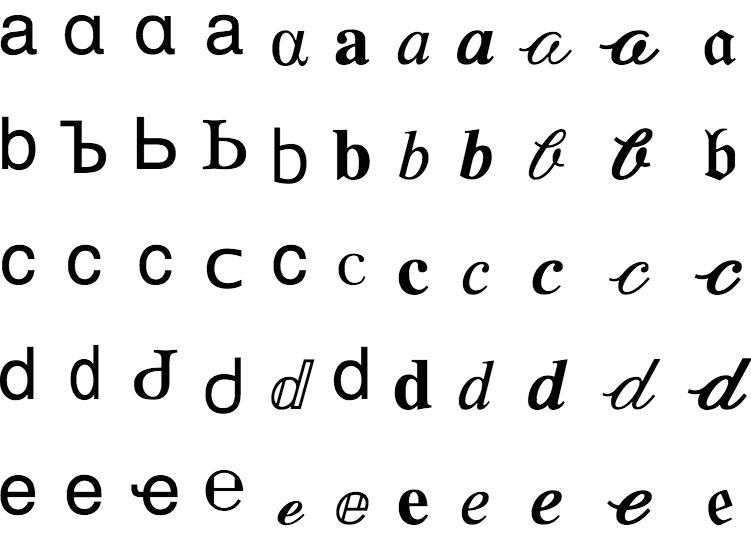
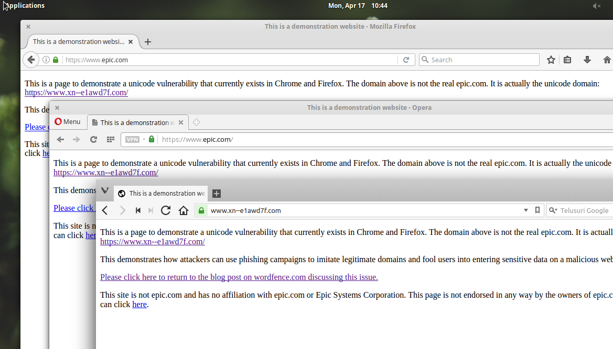

# Fingerprinting documents with steganography

Steganography is the practice of hiding messages anywhere they're not expected.
In a well-executed piece of steganography, anyone who is not the intended
recipient can look at the message and not realize its there at all. In a recent
headline-making
[story](http://www.bbc.com/future/story/20170607-why-printers-add-secret-tracking-dots),
The Intercept inadvertently outed their source by publishing a document with an
embedded steganographic message that allowed the NSA to identify the person who
printed it.


These days, information is often hidden in digital media like images and audio
files, where flipping a few bits doesn't change the file to the human eye (or
ear). Before computers came along, though, there were plenty of messages
creatively hidden in art, furniture, etc. There's speculation that women in the
U.S. used to hide messages in their quilt work as a way to help escaped slaves
find friendly homes. Neal Stephenson riffs on this theme in his Quicksilver
Trilogy by having Eliza embed a binary code in her cross-stitching to smuggle
information out of the court of Louis XIV.

Hiding messages in text has always been especially challenging. There's not much
room to make changes without fundamentally altering the meaning of the original
document, which in turn makes it obvious that something is amiss. If someone
other than the intended recipient of the information realizes that there's a
message present at all, the steganography has, in some sense, failed.

## What problem are we trying to solve?

In this post, I'll talk about fingerprinting documents using text-based
steganography. The problem we're trying to solve is as follows. We have a
sensitive document that must be distributed to some number of readers. Let's
say, for example, that Grandpa has decided to share his famous cookie recipe
with each of his grandchildren. But it's super important to him that the recipe
stays in the family! So they're not allowed to share it with anyone else. If
Grandpa finds pieces of his cookie recipe online later, he wants to know which
grandchild broke the family trust.

To address this problem, he assigns each of his grandchildren an ID, which is
just a string of zeros and ones. Before he gives out the recipe, he identifies a
number of 'branchpoints' in the text. These are places where he can make a
change without altering the grandchild's experience of the recipe, or alerting
them that something is amiss. One such branch point might be spelling out the
numbers in the recipe - "ten" instead of "10". Another might be using imperial
units instead of metric.

For each grandchild, he goes through the branchpoints one at a time. If the
grandchild's ID has a zero at some position, he does not make a change at the
corresponding branch point. If it is a one, he makes the change.

Now, by looking at which changes had been made in the leaked cookie recipe, he
should be able to identify which grandchild was the source of the leak.

How does he find all the branchpoints he can use to effectively fingerprint
the recipe?

Before we can answer that question, we'll have to take a slight detour into the
world of character encoding.

## Digital Character encoding

Computers think in binary, so when they save any symbol you might consider to be
text, what they're actually saving is some string of zeros and ones. The map
that converts between binary and symbols is called a character encoding.

For a long time, the dominant character encoding
was [ASCII](http://www.asciitable.com/), which can only encode 256 characters.
These include upper and lower case English letters, numbers, and some
punctuation.

A couple of decades ago, some folks got together and decided this wasn't good
enough, not least because people who don't speak English should be able to use
computers. They developed a specification called [unicode](http://unicode.org/)
that now includes over 120,000 different characters and has the capacity to
expand to over one million.

Fortunately for us, there's more room for hiding information these days than
there used to be. We'll see how we can take advantage of all those extra
characters to find branchpoints in any document.

### Identifying branchpoints

Some Unicode characters are more obviously useful than others. Take, for
instance, the [zero width space](https://codepoints.net/U+200B). It has some
semantic significance - it tells whatever is rendering the text that it's okay
to put a line break somewhere, even if there's no other whitespace character.
For example, it will sometimes be used after a slash - it's okay to start a new
line after a slash, but if you don't, there shouldn't be a visible space.

So​ what​ happens​ if​ you​ put​ one​
of​ those​ zero​-​width​ spaces​ right​
in​ front​ of​ a​ normal,​ every​ day​
space?​ Absolutely​ nothing.​ It​ conveys​ no​
extra​ information,​ and​ doesn't​ visibly​
change​ the​ text​ document​ at​ all.​ In​
fact,​ there's​ a​ zero-width​ space​ in​
front​ of​ every​ space​ in​ this​
paragraph.​ Bet​ you​ couldn't​ tell.

This means we can already treat every normal single space as a branch point,
where we can choose whether or not to place a zero width space in front of it.
Depending on how much information you're trying to encode, this may or may not
be a good idea.

There are a number of other non-displaying characters that we could use in a
similar way, but let's move on to characters we can actually see.

When you have 120,000 characters, some of them are bound to look the same.
Here's an [English character](https://codepoints.net/U+0041) A, and here's a
[Greek character](https://codepoints.net/U+0391) Α. See the difference?



Similar characters like these, called 'confusables', are recognized as being
dangerous enough that all modern browsers often some protection against letting
you visit spoofed urls. Think you're going to www.yahoo.com (all english
characters)? Well, you may end up at ԝԝԝ.𝐲𝖺𝗵օօ.сօⅿ (no english characters) if
you're not careful.

Here's a great unicode
[resource](http://unicode.org/cldr/utility/confusables.jsp?a=fast+forward+labs&r=None)
for identifying confusables.



Used judiciously, there are plenty of confusables that are, well, suitably
confusing. Here are a few rules of thumb: simpler letters are more easily
confused. For example, generally l-shaped things look more like each other than
g-shaped things. Standalone, one letter words are harder to spot because they
are separated by their neighbors by spaces, and so you don't automatically
visually juxtapose them with other characters. And, finally, how convincing your
confusables are will depend to some degree on the font. Some typefaces may
magnify the differences between confusables, while others will render
confusables as more similar to each other. Ultimately, you don't want to change
your readers' experience of the text in any way, so it's good to be careful with
these.

But using funny characters in unicode is sometimes dangerous. In particular, if
an unintended recipient of the message copies the text into an ASCII-only
editor, it won't know what to make of those crazy unicode characters and they'll
probably just show up as ????????, which is a pretty good hint to the interloper
that something strange is going on.

In the ASCII-only world, your options are much more limited. In general, though,
any time you make a stylistic decision that could go either way, you can
consider that to be a branch point. For example, do you use single quotes or
double quotes? Do you spell out numbers, or do you use the numeric
representations? If you want to be consistent throughout your document, each of
these decisions will only get you one bit of hidden information. Because you
have fewer options, you'll have to get more creative.

For example, we put five branchpoints in the following to produce a 5-bit message:

- Ralphie set his secret decoder ring to "B" and "twelve" to decode the message.
  It said, "Be sure to drink your Ovaltine". (00000)  
- Ralphie set his secret decoder ring to 'B' and 'twelve' to decode the message.
  It said, "Be sure to drink your Ovaltine". (10000)  
- Ralphie set his secret decoder ring to "B" and "12" to decode the message. It
  said, "Be sure to drink your Ovaltine". (01000)  
- Ralphie set his secret decoder ring to "B" and "twelve" to decode the message.
  It said "Be sure to drink your Ovaltine". (00100)  
- Ralphie set his secret decoder ring to "B" and "twelve" to decode the message.
  It said, 'Be sure to drink your Ovaltine'. (00010)  
- Ralphie set his secret decoder ring to "B" and "twelve" to decode the message.
  It said, "be sure to drink your Ovaltine". (00001)  
- Ralphie set his secret decoder ring to 'B' and '12' to decode the message. It
  said 'be sure to drink your Ovaltine'. (11111)

## Introducing: Steganos

In order to play around with these concepts, we created a tool called
[steganos](http://github.com/fastforwardlabs/steganos). Steganos is packaged
with a small library of branchpoints (pull requests for new branchpoints are
welcome!) and has the ability to: calculate the number of encodable bits,
encode/decode bits into text and do a partial recovery of bits from text
snippets. All this is possible by tracking the original unadulterated text as
well as which branchpoints were available to steganos when the message was
encoded.

As an example, using the [current
version](http://github.com/fastforwardlabs/steganos/tree/2378a]) of steganos, we
can encode 1756 bits into this text. If we are using this for user-identification
and expect to always see leaks of the full document, that means we can track
10^529 users (ie: vastly more than the number of people who have ever existed).


```.py
import steganos

message = '101'
original_text = '"Wow!" they said.\n\t"This tool is really #1"'

capacity = steganos.bit_capacity(original_text) # == 10
encoded_text = steganos.encode(message, original_text)

recovered_bits = steganos.decode_full_text(encoded_text, original_text,
                                           message_bits=3)
# recovered_bits == '101'

partial_text = encoded_text[:8]  # only use 18% of the text
recovered_bits = steganos.decode_partial_text(partial_text, original_text,
                                              message_bits=3)
# recovered_bits == '1?1'
```

As an example, below is the opening to Star Wars with and without a message
hidden inside of it. Do you know which is the original?

```
It​ is a period of civil​ war. Rebel​ spaceships, striking​ from​ a hidden base, have​ won their first​ victory​ against the evil​ Galactic​ Empire‏‎.
D⁠uring the battle, Rebel spies​ managed to​ steal​ secret plans​ to the​ E⁠mpire's ultimate​ weapon, the D⁠EA⁠TH ST⁠A⁠R, an​ armored space station with enough​ power​ to destroy an​ entire planet‏‎.
Pursued​ by the​ Empire's sinister​ agents, P⁠rincess L⁠eia​ races​ home aboard​ her starship, custodian of the​ stolen​ plans that can save her​ people and​ restore​ freedom​ to the galaxy‏‎...‏‎.
```

```
It is a period of civil war. Rebel spaceships, striking from a hidden base, have won their first victory against the evil Galactic Empire.
During the battle, Rebel spies managed to steal secret plans to the Empire's ultimate weapon, the DEATH STAR, an armored space station with enough power to destroy an entire planet.
Pursued by the Empire's sinister agents, Princess Leia races home aboard her starship, custodian of the stolen plans that can save her people and restore freedom to the galaxy....
```

## Conclusion

Here we've seen a number of tricks we can use to fingerprint each individual
copy of a document, without changing the reader's experience or alerting them
that they have a uniquely identifiable copy. There are a few practical
considerations you'll have to address if you go down this route - like how you
identify the user from partial documents, or how you systematically mark pieces
of text that cannot be changed without breaking the document (e.g. urls) - but
these are mostly logistical issues.

Fingerprinting documents in this way can be a powerful tool in finding out who
breached a confidentiality agreement. On the flip side, it can also be used to
track people's behavior in ways they haven't agreed to, which is something to be
cautious of. There's a little too much of that going on on the internet as it
is.

Do you have ideas for other cool branchpoints? Let us know!

- [Noam](https://github.com/n-s-f) and [Micha](http://github.com/mynameisfiber/)

Thanks to [Manny](https://twitter.com/MannyMoss) for his great edits!

PS: If you want to make sure you _aren't_ being tracked this way, simply make
sure you only copy the ASCII transliterated version of text! In some systems,
this is done by selecting the "Copy as Plain Text" option.
